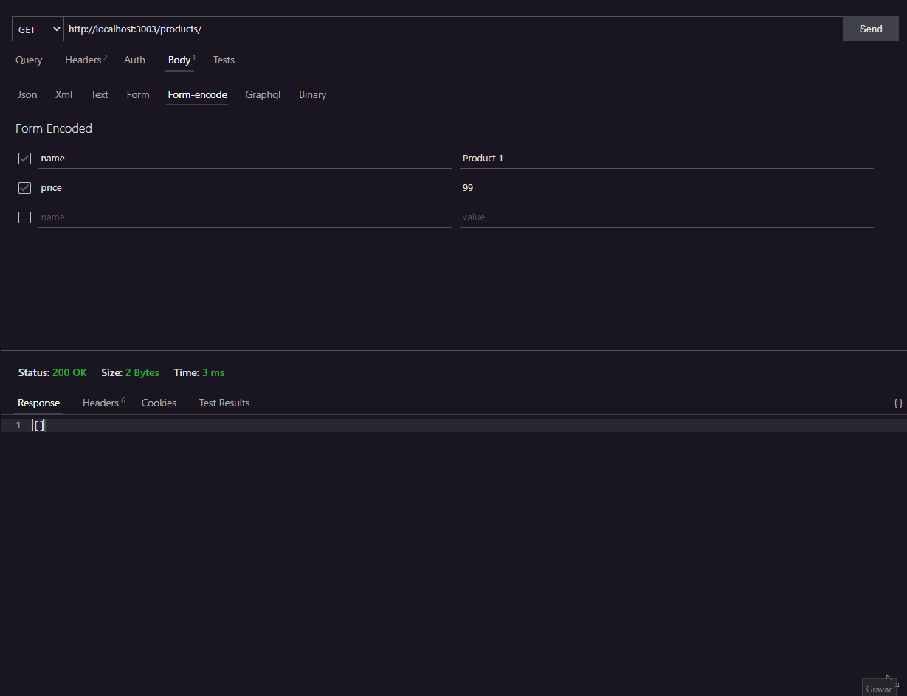

# Express.js API


## About 
<p align="center">A simple CRUD API using express.js.</p>

<h3 align="center">
  <a href="#" target="_blank">
    
  </a>
</h3>

## Table of contents

<!--ts-->
   * [About](#about)
   * [Table of contents](#table-of-contents)
   * [Status](#status)
   * [Features](#features)
   * [Como usar](#como-usar)
      * [Pre Requisitos](#pre-requisitos)
      * [Local files](#local-files)
      * [Remote files](#remote-files)
      * [Multiple files](#multiple-files)
      * [Combo](#combo)
   * [Tests](#testes)
   * [Tecnologias](#tecnologias)
<!--te-->

## Status

<h4 align="center"> 
	🚧  Express.js CRUD API 🚀 Em construção...  🚧
</h4>

## Features

- [x] Cadastro de usuário
- [x] Cadastro de cliente
- [ ] Cadastro de produtos

## Preview

Sample preview running the API:



## Pré-requisitos

Antes de começar, você vai precisar ter instalado em sua máquina as seguintes ferramentas:
[Git](https://git-scm.com), [Node.js](https://nodejs.org/en/). 
Além disto é bom ter um editor para trabalhar com o código como [VSCode](https://code.visualstudio.com/)

## 🎲 Rodando o Back End (servidor)

```bash
# Clone este repositório
$ git clone <https://github.com/tgmarinho/nlw1>

# Acesse a pasta do projeto no terminal/cmd
$ cd nlw1

# Vá para a pasta server
$ cd server

# Instale as dependências
$ npm install

# Execute a aplicação em modo de desenvolvimento
$ npm run dev:server

# O servidor inciará na porta:3333 - acesse <http://localhost:3333>
```
## 🛠 Tecnologias

As seguintes ferramentas foram usadas na construção do projeto:

- [Expo](https://expo.io/)
- [Node.js](https://nodejs.org/en/)
- [React](https://pt-br.reactjs.org/)
- [React Native](https://reactnative.dev/)
- [TypeScript](https://www.typescriptlang.org/)

